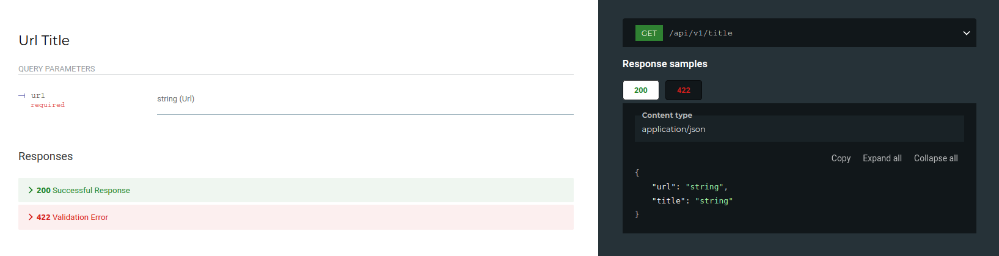
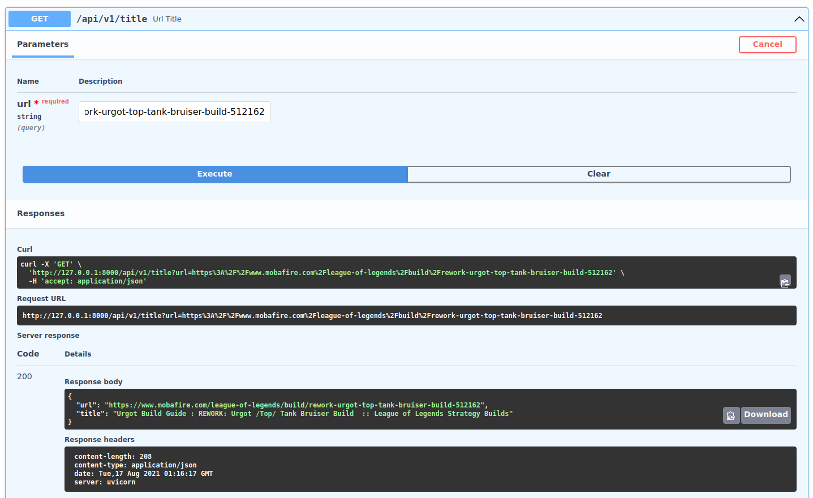
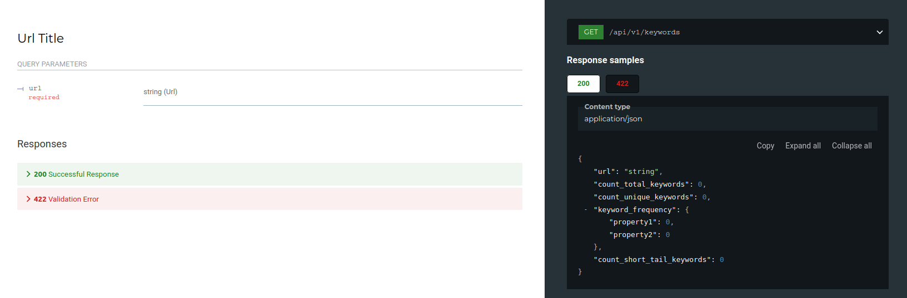
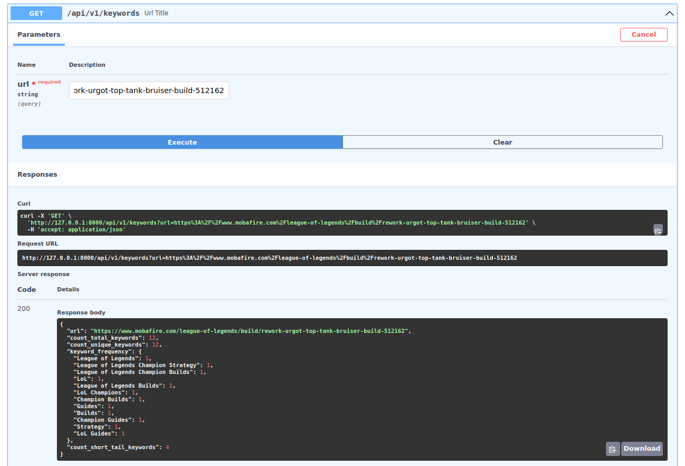

# URL API + URL Title Extractor from file

## **Technologies**

    - Python 3.8
    - FastAPI

## **Get Started**

To run this API, the following steps must be followed:

1. Clone this repository on you local machine,
2. Open the app containing folder "url_exercise",
3. Create a python virtual enviroment,
4. Activate the virtual enviroment and install the required packages listed in the requirements.txt file,
5. The function `url_title_from_csv()` created to extract a website's title from a file with all desired urls is located in url_csv_reader.py,
6. To run the API, change directory to 'app'
7. Open the terminal and run the following command: `uvicorn main:app`
8. Open your web browser with the link provided in the terminal

## API Response and Resquest Examples

**Request Title Endpoint and Response**

**Example of title endpoint**

**Request Keywords Endpoint and Response**

**Example of title endpoint**
